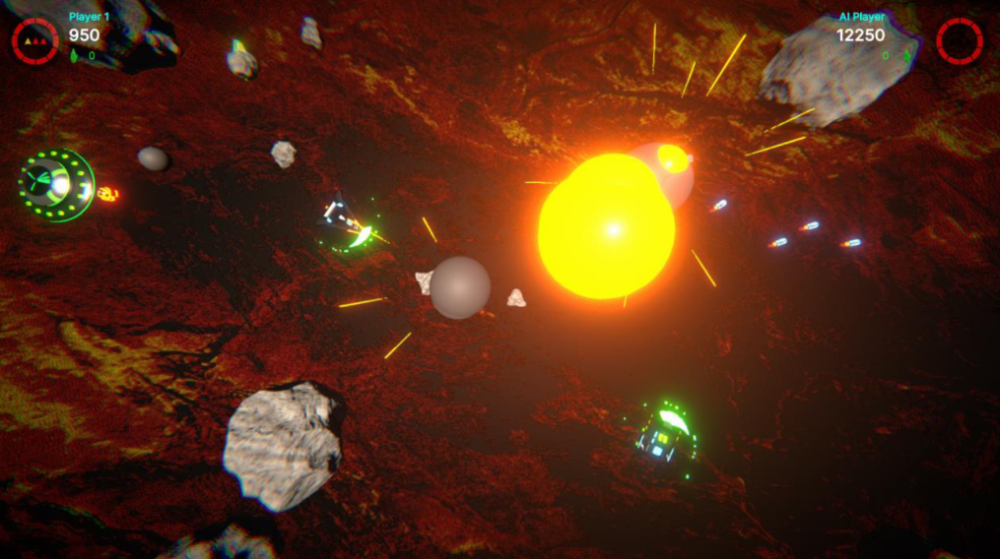

# Iterium - Retro Space Game

Iterium is a retro-style space game built using webGL in Unity, designed to serve as a base project for creating customized versions that can integrate with various web platforms through SDKs or APIs. The game is an open-source project available on git, and its purpose is to provide a platform for game developers to learn about real-world implementation of APIs, SDKs, Web3 Wallets or Interactions with Blockchain technologies, Infrastructure and publishing. 

One of the benefits of creating and using an open-source game like Iterium is the flexibility it provides. Because it is open-source, developers can modify the code to suit their needs and integrate it with different platforms using various APIs or SDKs. This allows game developers to experiment with different integrations without having to create a game from scratch, saving them time and effort.

Lastly Iterium serves as an educational tool for game developers to learn about different APIs and SDKs. Each customized version created using Iterium can showcase how different APIs and SDKs work and how they can be integrated with web platforms.

Head on over to the Iterium [Github](https://github.com/Made-For-Gamers/Iterium-Unity) and clone it to play around or check out the forks that we have done.

Or you could head straight to [Iterium](http://iterium.mfg.gg) to have a go at the launched version.

