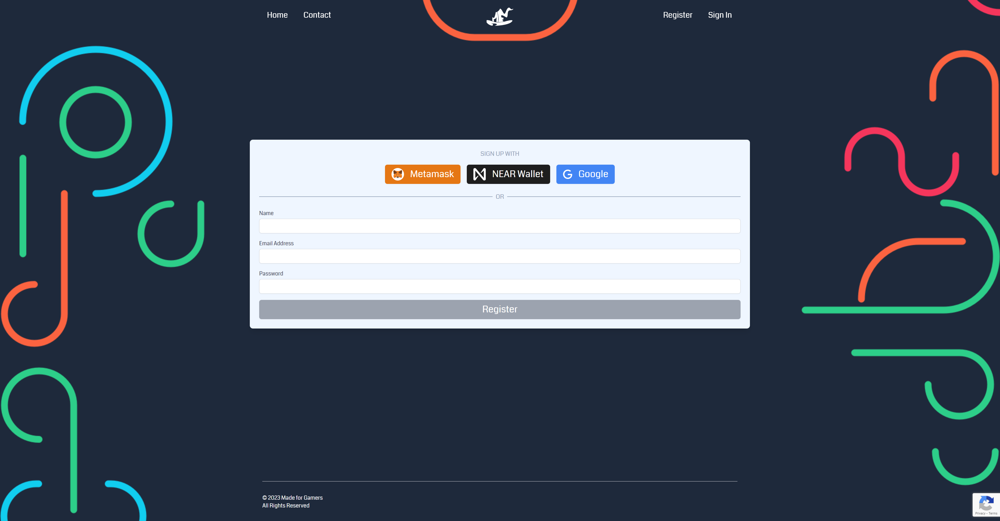
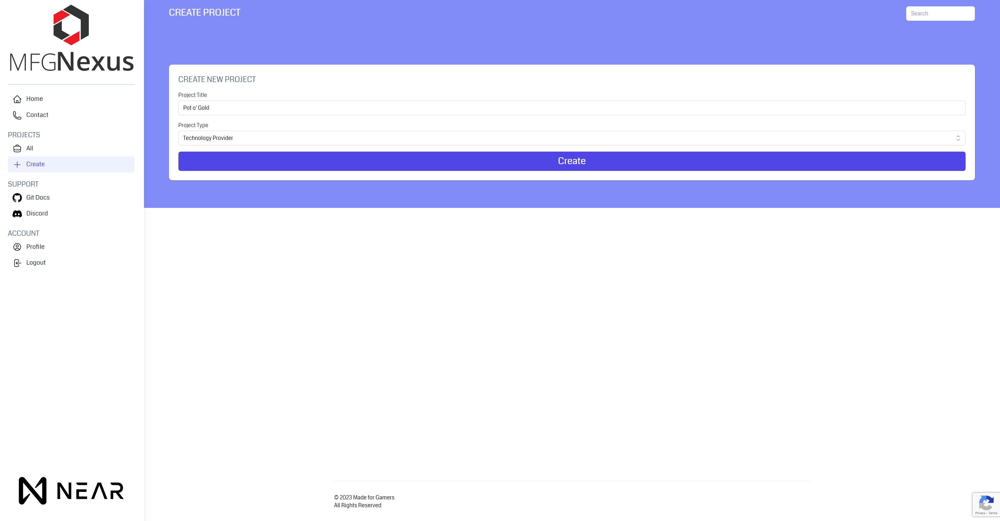
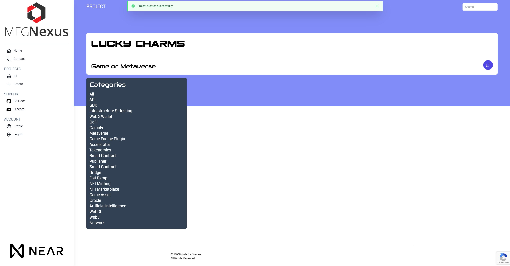
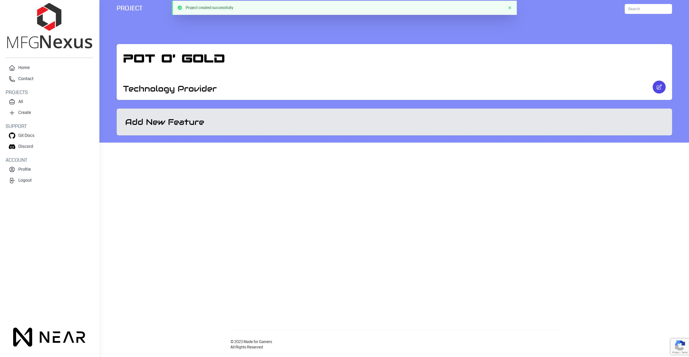
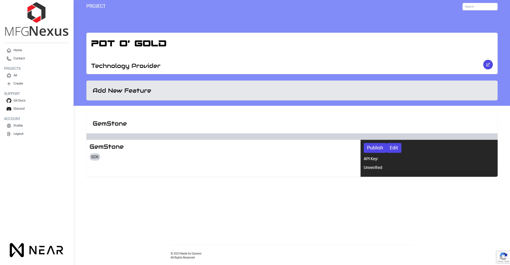

# **User Guide** :book:

### Prerequisites

Before you begin, you need a NEAR wallet. You can create one by visiting the following links. For logging in to [MFG.gg](https://www.mfg.gg/sign-in) we recommend using a mainnet wallet.

- Near Wallets
    - [Mainnet Wallet](https://wallet.near.org/)
    - [Testnet Wallet](https://wallet.betanet.near.org/)

### Registration

To register on [MFG.gg](https://www.mfg.gg/register) you can either use a NEAR wallet or your email and password.

If you are looking register for the gamejam then you can head over to [MFG Home Page](https://www.mfg.gg)

### Projects

After signing up, you need to create a project. You have two options to choose from:

1. **Game or Metaverse**

    This can be any game title or virtual experience that you want to set up to receive features from tech providers on the platform. 

2. **Technology Provider**

    Technology provider projects are for creators to provide their creations for other game creators to use. There are a wide range of categories that would fit on a feature level.

### Features

Features vary depending on your project type. A feature can either be used by a game developer or provided by the tech provider.

#### Adding a feature 

##### Game or Metaverse Project

1. After creating your project as a Game or Metaverse, you will be prompted to add features to your new project.

If you arent certain on the feature you would like to add, then you can look into using our exciting wizard- which will help you filter down on some of the tools by asking you questions aroudn the title you are building:

?> _TODO_ Add Screenshots

 
2. Select the desired features to be added to your project. You can configure them to your liking, find documentation, examples implementations and details around the creator behind the feature offering.

?> _TODO_ Add Screenshots
 
##### Technology Provider

1. Creating a feature as a tech provider requires you to provide some details and set categories around the feature type. Once complete, you can set your feature to draft or preview its detail page.

After completing the details, you can choose to set your feature to draft or publish it. The feature will go through a review process, where one of our team members will verify that your feature is legitimate, fits the correct category, and is suitable for a use case in an example game. We will be in touch soon.

#### Conclusion

This concludes the user guide for MFG NEAR Nexus. We hope that you find this guide helpful and that it provides you with the necessary information to get started with your project. If you have any questions or concerns, please feel free to [reach out](https://discord.gg/HNhQPgDg) to our support team. Thank you for choosing MFG NEAR NEXUS!